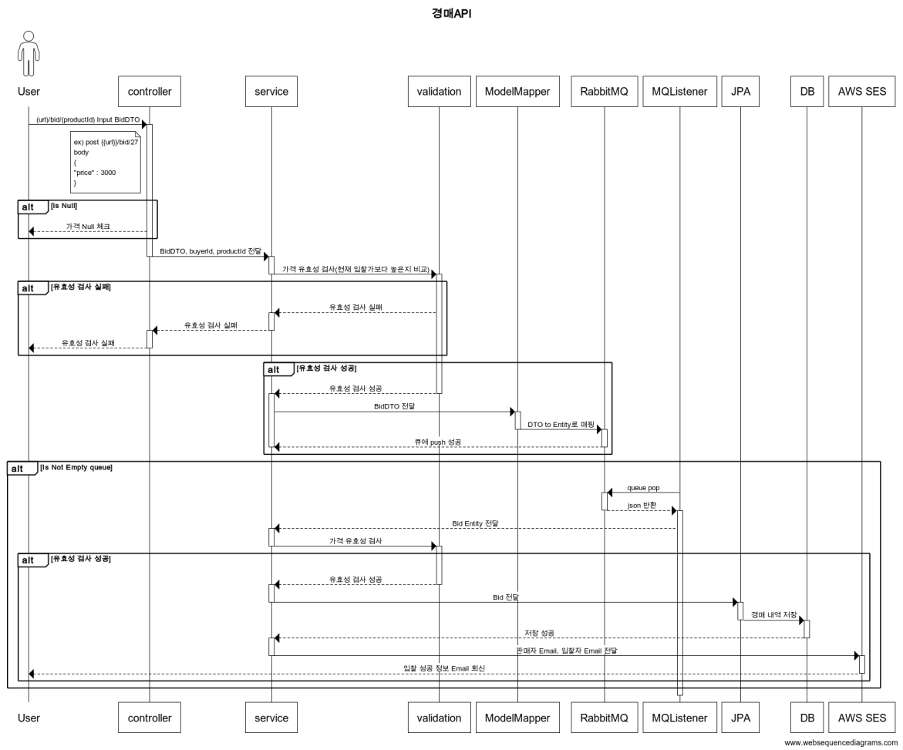

# Auction-server
옥션 중고 경매 시스템과 같은 경매 서비스 백엔드 서버

- 참고 : https://corners.auction.co.kr/corner/UsedMarket.aspx

- 경매 판매 방식
    - 경매 시작 금액을 1,000원 부터 원하는 대로 설정할 수 있으며, 즉시구매 가격도 필요한 경우 등록 가능
    - 경매로 등록한 물품은 입찰 후 내용 수정이 불가하며, 물품 상세 설명 추가만 가능하니 등록 시 주의
- 프로토타입 : https://ovenapp.io/view/sb7Z9CpgM2xzq7HRLyYAyNr6enzrarx3/
---
# 목적
- 대용량 트래픽을 고려한 어플리케이션(초당 500tps 이상의 입찰API)
- 객체지향적으로 접근하여 유지보수할때 클린 코드구현을 통해 가독성을 높이는 목적
- 단위테스트를 통한 검증가능한 코드
---
# 사용기술
- JAVA11, Spring Boot, JPA, Redis, MySQL
---
# 프로그램 주요 기능
- 회원관리
    - 회원가입 기능, 회원 수정, 회원탈퇴
    - 아이디 중복 체크
    - 비밀번호 암호화
    - 로그인, 로그아웃
    - 회원 수정
    - 유저 상태(판매자, 구매자, 관리자, 인증대기)
    - 본인확인 기능(이메일을 통한 인증)
    - 자신의 이상 유저 제재 로그 확인
- 상품 관리 및 경매 상태 관리
    - 상품 등록, 조회, 삭제 기능
    - 상품 문의 기능(댓글)
    - 입찰 종료 상품은 자신만 조회
    - 상품 상태관리
        - 상품 등록
        - 경매 시작
        - 경매 종료
        - 배송 중
        - 배송 완료
        - 경매 일시 정지(관리자에 의한)
    - 상품삭제 (상태가 상품등록일 경우, 그 외엔 삭제 불가)
- 관리자 기능
    - 이상 유저 제재
        - 대량 등록(1000milli second 안에 10개 이상의 물품을 등록할때, 사람이 아닌 api 또는 툴을 이용했을때)
        - 6개월 이상의 미접속자
    - 카테고리 관리
        - 입찰 단위 설정
    - 공지글 추가
    - 상품 관리
- 상품 검색
    - 상품이름, 판매자, 카테고리로 검색
    - 입찰자가 많은 순으로 정렬
    - 최저, 최고 즉시 구매가 순
    - 최저, 최고 입찰가 순
    - 등록일 최신 순, 과거 순
- 입찰 기능
    - 즉시 구매
    - 입찰
        - 최저 입찰 단가
        - 최고 입찰 단가
        - 입찰 단위
    - 히스토리 데이터 추가(입찰시간, 입찰자, 입찰가, 판매자, 즉시구매가)
- 알림
    - 시작 및 종료 알림
    - 입찰시 알림
    - 경매 결과 알림
    - 경매 기록(ID, 입찰일자, 입찰가격)
- 경매 이력 조회
    - 자신의 경매 기록 확인
    - 상품의 경매 기록 확인
---
# 객체 변환 과정

---
# ERD(Entity Relationship Diagram)

---
# 입찰 시퀀스

